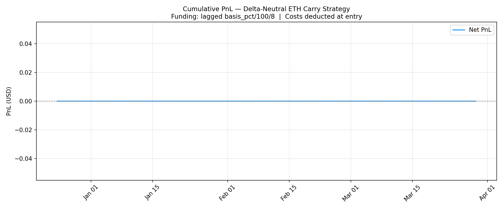
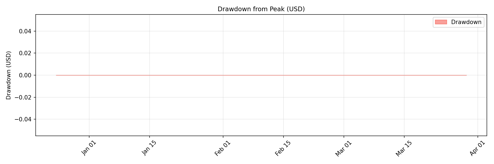
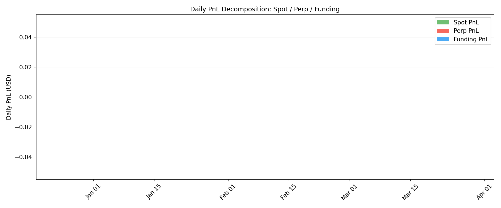

# Delta-Neutral ETH Carry Strategy: On-Chain Proof-of-Concept and Real-Data Backtest

**Course:** [Course Name]
**Team:** [Names]
**Date:** [Date]
**Testnet:** Sepolia
**Repository:** [GitHub URL]

---

## Abstract

This project designs, implements, and analyses a delta-neutral ETH carry strategy that simultaneously holds a long ETH spot allocation and a short ETH perpetual futures position of equal notional. The two legs approximately cancel price risk (delta-neutral), leaving the perpetual funding rate as the net income source. We built five verified Solidity smart contracts on the Sepolia testnet — including a Chainlink oracle integration and a rule-based strategy vault — as an on-chain proof-of-concept of the mechanism. A real-data backtest using 1-hour OKX spot ETH/USDT and OKX perpetual ETH/USDT data (Jan 2020 – Mar 2026, 54,706 hourly bars) measures historical profitability over a 6-year window with a carry entry gate, decomposing returns into funding carry, transaction costs, and hedge residual. With the carry gate active, the strategy generated +$16,753 net profit (+26.83% annualised) on $10,000 capital over 2,279 days, sitting out 42% of the period during backwardation regimes.

---

## 1. Introduction

### 1.1 Motivation

Perpetual futures markets in crypto operate through a funding rate mechanism: when long demand exceeds short demand, the contract price rises above spot, and a periodic payment transfers from long traders to short traders to enforce price convergence. In crypto bull markets, retail investors exhibit a systematic long bias — they want leveraged upside exposure to assets like ETH. This creates persistent positive funding rates (contango), which short sellers systematically collect as income. By combining a long spot position with a short perpetual of equal notional, a trader can harvest this funding premium with approximately zero net price risk. This is the delta-neutral carry trade.

### 1.2 Project Objective

This project has two objectives:

1. **Academic:** Analyse the historical profitability of a delta-neutral ETH carry strategy using real market data (Coinbase spot / Deribit perp). Measure how the strategy performs across different funding rate regimes, and whether funding income meaningfully exceeds the benchmark opportunity cost after costs.

2. **Implementation:** Deploy a working on-chain proof-of-concept on Sepolia that correctly implements the vault structure, carry entry gate, exit conditions, and PnL accounting — demonstrating that the mechanism can be enforced in Solidity.

### 1.3 Scope and Limitations

- **Not a live trading system.** No real exchange connectivity. `MockPerpEngine` simulates perpetual mechanics without order books, counterparties, or real settlement.
- **Backtest uses local CSV files.** Data is sourced from CoinAPI (Coinbase spot + Deribit perp) and placed in `data/raw/`. The backtest does not pull live feeds.
- **No rebalancing.** The basic backtest holds a fixed 1:1 notional position throughout with no delta rebalancing.
- **On-chain and backtest layers are independent.** The contracts do not execute the historical backtest; they demonstrate the mechanism.

### 1.4 Report Structure

Section 2 covers background on perpetual futures and funding rates. Section 3 defines the strategy. Section 4 presents the mathematical model. Section 5 covers the smart contract design. Section 6 covers oracle design. Section 7 covers deployment. Section 8 presents backtest results. Section 9 describes the frontend. Section 10 covers gas analysis. Section 11 discusses risks. Section 12 concludes.

---

## 2. Background

### 2.1 Perpetual Futures and Funding Rates

A perpetual futures contract tracks an underlying asset without an expiry date. Without expiry, a separate mechanism is needed to keep the contract price anchored to spot. Exchanges use a **funding rate**: at regular intervals (every 8 hours on major exchanges), a payment is transferred between long and short position holders proportional to the divergence between mark price and index price:

```
fundingRate = (markPrice − indexPrice) / indexPrice
```

When the funding rate is positive (mark above spot, contango), long traders pay short traders. When negative (backwardation), short traders pay long traders. This mechanism prevents the perpetual from drifting permanently from the underlying.

### 2.2 Why Contango Persists in Crypto

Crypto retail investors exhibit a strong long bias — they seek leveraged upside exposure to ETH and BTC. Perpetual futures are the primary vehicle. This excess long demand persistently pushes the mark price above spot in bull and neutral markets, generating a positive funding rate. Historical data shows that the average ETH perpetual funding rate has been positive over most of the 2021–2024 period, ranging from approximately 0.01% per 8-hour period in quiet markets to over 0.1% during peak bull markets. Short sellers who hold positions through these periods collect this income systematically.

### 2.3 The Delta-Neutral Cash-and-Carry

A pure cash-and-carry trade holds a spot ETH long and an equal short perp. Price moves cancel:
- ETH rises by X%: spot position gains X%, perp short loses X% → net price PnL = 0
- ETH falls by X%: spot position loses X%, perp short gains X% → net price PnL = 0

The only net income is the funding rate received on the short leg, minus the opportunity cost of the capital. This is analogous to a basis trade in traditional finance.

---

## 3. Strategy Definition

### 3.1 Position Structure

| Component | Size | Direction | Purpose |
|-----------|------|-----------|---------|
| Spot allocation | = Capital | Long | Tracks ETH price, cancels perp price risk |
| Perp notional | = Capital | Short | Collects funding income in contango |
| Perp collateral | 20% of notional | Posted margin | Supports 5× leverage on the short |

### 3.2 Profit Sources

```
Daily net PnL = spot_pnl + perp_pnl + funding_income − benchmark_cost

Where:
  spot_pnl      = notional × (price_t / price_{t-1} − 1)
  perp_pnl      = −spot_pnl                          (exact mirror, cancels)
  funding_income = notional × dailyFundingRate
  benchmark_cost = capital × (benchmarkRate / 365)

Therefore:
  daily net PnL ≈ funding_income − benchmark_cost     (price legs cancel)
```

### 3.3 Carry Score

The carry score measures whether the funding rate justifies entering the position relative to its opportunity cost:

```
carryScore = (dailyFundingRate × 365) − benchmarkRate − costs

Entry when: carryScore > dynamicThreshold
  dynamicThreshold = costs + (leverage × riskPremium)
```

### 3.4 Why This Is Not Pure Risk-Free Arbitrage

The strategy retains several real risks:
1. **Funding reversal:** If funding turns persistently negative (backwardation), the strategy loses money even with delta-neutrality.
2. **Margin / liquidation risk:** The short perp uses 5× leverage. A sharp ETH price rise can erode the collateral buffer faster than funding income accumulates.
3. **Execution cost drag:** Entry/exit costs, fee drag, and market impact reduce net returns.
4. **Rebalancing risk:** As prices move, the hedge ratio drifts away from 1:1, reintroducing delta.

---

## 4. Mathematical Model

### 4.1 Core Formulas

All formulas are implemented identically in `contracts/core/ArbitrageMath.sol` and `backtest/strategy.py`.

**Spot leg PnL** (long):
```
spotPnL = spotAllocation × (currentPrice − entryPrice) / entryPrice
```

**Short perp price PnL** (equals −spotPnL at equal notional):
```
shortPricePnL = notional × (entryPrice − currentPrice) / entryPrice
```

**Delta neutrality:** `spotPnL + shortPricePnL = 0`

**Funding income** (received by short when rate > 0):
```
fundingPayment = notional × dailyFundingRateBps / 10 000
```

**Carry score** (annualised bps):
```
carryScore = (dailyFundingRateBps × 365) − benchmarkRateBps − costBps
```

**Margin ratio:**
```
marginRatio = (collateral + unrealisedPnL) / notional  [in bps]
```

**Break-even days:**
```
breakEvenDays = entryCostUSDC / dailyNetYieldUSDC
```

### 4.2 Worked Example

$100,000 capital, 3 bps/day funding, 2% benchmark rate (200 bps), 5× leverage:

| Day | ETH Price | Spot PnL | Perp PnL | Net Delta | Funding | Benchmark | Daily Carry |
|-----|-----------|----------|----------|-----------|---------|-----------|-------------|
| 0   | $2,000    | $0       | $0       | $0        | $0      | $0        | −$50 (entry cost) |
| 1   | $2,000    | $0       | $0       | $0        | +$30    | −$5.48    | +$24.52     |
| 1   | $2,100    | +$5,000  | −$5,000  | $0        | +$31.50 | −$5.48    | +$26.02     |

Note: in both price scenarios, the daily carry is the same — delta-neutral.

---

## 5. Smart Contract Design

### 5.1 Architecture Overview

```
User deposits USDC
        │
        ▼
StrategyVault
        │
        ├── Records spotAllocationUsdc (= notional, long leg)
        │
        └── Calls perpEngine.openShort(notional, collateral)
                          │
                          ├── Accrues funding income per second
                          └── Tracks short price P&L

                  oracle.getPrice() ←── ChainlinkPriceOracle ←── Chainlink ETH/USD feed
```

### 5.2 Contract Descriptions

#### ArbitrageToken (CARB)
- Standard ERC20, 18 decimals, max supply 10,000,000
- Symbol: CARB, Name: Crypto Arbitrage Token
- Satisfies course ERC20 deployment requirement

#### MockUSDC
- Mintable ERC20, 6 decimals (matches real USDC)
- Owner can mint arbitrary amounts for testing

#### IPriceOracle / MockPriceOracle / ChainlinkPriceOracle
- Interface-based oracle abstraction
- MockPriceOracle: settable price for local tests
- ChainlinkPriceOracle: wraps Chainlink AggregatorV3, normalises to 18 decimals, staleness check

#### ArbitrageMath (library)
- Pure math library: all financial formulas in one place
- Functions: `calcSpotPnL`, `calcShortPricePnL`, `calcFundingPayment`, `calcMarginRatio`, `calcHealthFactor`, `calcCarryScore`, `isCarryViable`, `calcBreakEvenDays`
- Identical formulas to the Python backtest

#### MockPerpEngine
- Tracks one short position per address
- Funding accrues continuously (per second via block.timestamp)
- Functions: `openShort`, `closeShort`, `accrueFunding`, `getUnrealizedPnL`, `getMarginRatio`, `isLiquidatable`

#### StrategyVault
- Main orchestrator
- Accepts USDC deposits, tracks shares
- Records both legs: `spotAllocationUsdc` and `hedgeNotional`
- Carry gate: `carryScore = (funding × 365) − benchmarkRate − costs`
- Entry gated by leverage-scaled dynamic threshold
- `getVaultState()` computes and returns `netDeltaPnL` (verifies ≈ 0)
- Exit conditions: MARGIN, CAPITAL, CARRY, TIME

### 5.3 Key Function: openHedge

```solidity
function openHedge(uint256 notional, uint256 collateral, int256 dailyFundingRateBps_)
    external onlyOwner
{
    // 1. Compute leverage-scaled carry threshold
    uint256 leverageRatio  = notional / collateral;
    int256  threshold      = int256(costEstimateBps + leverageRatio * riskPremiumPerLeverageUnit);

    // 2. Compute carry score: (funding × 365) − benchmark − costs
    int256 carryScore = ArbitrageMath.calcCarryScore(
        benchmarkRateBps, dailyFundingRateBps_, costEstimateBps
    );

    // 3. Reject if carry is insufficient
    require(ArbitrageMath.isCarryViable(carryScore, threshold), "carry score below dynamic threshold");

    // 4. Record entry price, open short perp, record spot allocation
    hedgeEntryPrice    = oracle.getPrice();
    perpEngine.openShort(notional, collateral);
    spotAllocationUsdc = notional;
}
```

### 5.4 Security Measures
- `ReentrancyGuard` on all state-changing functions
- `SafeERC20` for all token transfers
- `Ownable` (OZ v5) with explicit owner address in constructor
- Oracle staleness check (3600 seconds) in `ChainlinkPriceOracle`
- CEI pattern (Checks-Effects-Interactions)

---

## 6. Oracle Design

### 6.1 Interface Abstraction

```solidity
interface IPriceOracle {
    function getPrice()  external view returns (uint256); // 18 decimals
    function decimals()  external pure returns (uint8);
}
```

### 6.2 Chainlink Integration

- Feed: ETH/USD on Sepolia (`0x694AA1769357215DE4FAC081bf1f309aDC325306`)
- Chainlink answer: 8 decimals → scaled to 18 in `getPrice()`
- Staleness check: reverts if `block.timestamp − updatedAt > 3600` seconds

### 6.3 Swap Pattern

Deploy script selects oracle at deploy time:
- `--network localhost` → `MockPriceOracle`
- `--network sepolia` → `ChainlinkPriceOracle`

---

## 7. Deployment and Verification

### 7.1 Deployed Contract Addresses (Sepolia)

| Contract | Address | Etherscan |
|----------|---------|-----------|
| MockUSDC | `0x84EAb608016e21E4618c63B01F7b3b043F4f457e` | [View ↗](https://sepolia.etherscan.io/address/0x84EAb608016e21E4618c63B01F7b3b043F4f457e) |
| ArbitrageToken (CARB) | `0xd2E7bA891e0Ecd142695d04e8Ed79e0C4947922F` | [View ↗](https://sepolia.etherscan.io/address/0xd2E7bA891e0Ecd142695d04e8Ed79e0C4947922F) |
| ChainlinkPriceOracle | `0x27768a80Fb849F6c1bB941C8de62F417Cd968e35` | [View ↗](https://sepolia.etherscan.io/address/0x27768a80Fb849F6c1bB941C8de62F417Cd968e35) |
| MockPerpEngine | `0x478832D03495390E47aFD238A9bA11414096A452` | [View ↗](https://sepolia.etherscan.io/address/0x478832D03495390E47aFD238A9bA11414096A452) |
| StrategyVault | `0x036EA2E331994a04d853B54Ad19D05524eC5b399` | [View ↗](https://sepolia.etherscan.io/address/0x036EA2E331994a04d853B54Ad19D05524eC5b399) |

### 7.2 Etherscan Screenshots

All contracts verified and interactions executed on Sepolia. Screenshots in `output/screenshots/`.

- [x] CARB token page (verified) — ArbitrageToken at `0xd2E7...`
- [x] StrategyVault page (verified) — `0x036E...`
- [x] `deposit()` transaction — $10,000 USDC deposited
- [x] `openHedge()` transaction — notional $10k, collateral $2k, 3 bps/day
- [x] `getVaultState()` read call — `netDeltaPnL = 0`, `carryScore = 845 bps`, `fundingIncomeTotal = 57083`
- [x] `isCarryViable()` output — returns `true` at 3 bps/day

### 7.3 Gas Costs

Gas figures from `gas-report.txt` (Solidity 0.8.24, optimizer enabled, 200 runs):

| Operation | Gas Used (avg) | Notes |
|-----------|----------------|-------|
| deploy StrategyVault | 2,314,258 | Main orchestrator |
| deploy MockPerpEngine | 1,404,719 | Perp engine |
| openHedge() | ~333,000 | Oracle read + approve + openShort |
| closeHedge() | ~110,000 | closeShort + USDC return |
| deposit() | ~170,000 | Share mint + USDC transfer |
| withdraw() | ~66,000 | Share redemption |
| accrueFunding() | ~58,000 | Single storage update |

---

## 8. Backtest Results

### 8.1 Data Sources

| Data | Source | Exchange | Frequency | Period |
|------|--------|----------|-----------|--------|
| ETH spot price | OKX public API (no key required) | OKX | 1-hour bars | Jan 2020 – Mar 2026 |
| ETH perp price | OKX public API | OKX | 1-hour bars | Jan 2020 – Mar 2026 |
| Funding rate | Derived from basis spread | — | Per bar | Full period (proxy) |

Dataset: `data/raw/eth_cash_carry_binance_spot_perp_5yr.csv` (54,706 hourly bars).
Downloaded via `backtest/fetch_binance.py` — no API key required.

**Note on funding proxy:** The OKX public API provides only ~3 months of historical funding settlement data. For the full 6-year window, the backtest uses a lagged basis proxy:

```
funding_pnl_t = position_size × perp_price_t × (basis_pct_{t-1} / 100 / 8)
```

`basis_pct = (perp_close − spot_close) / spot_close × 100`. Dividing by 8 converts the 8-hour-equivalent rate to hourly. The basis is **lagged one bar** (t−1) to avoid look-ahead bias. This proxy approximates but does not exactly replicate exchange-settled funding, as exchanges cap funding at ±0.75% per 8h. The proxy may overstate funding during extreme bull periods (basis > 0.75% per 8h).

### 8.2 Backtest Parameters

| Parameter | Value | Notes |
|-----------|-------|-------|
| Initial capital | $10,000 USDC | |
| Position size | Capital / spot price at entry | Recalculated at each re-entry |
| Funding formula | `lagged basis_pct / 100 / 8` | Proxy; see note above |
| Transaction cost | 0.20% of capital ($20 per trade) | ~0.12% spot + ~0.10% perp round-trip |
| Carry gate | 7-day rolling avg basis > 250 bps annualised | Mirrors `StrategyVault.sol` carry score |
| Gate granularity | Daily (checked once per day) | Prevents intraday churn |
| Rebalancing | None | Static 1:1 hedge ratio |
| Benchmark rate | 2% annual | Opportunity cost subtracted |

### 8.3 Results

**Chart 1: Cumulative Net P&L**


**Chart 2: Drawdown**


**Chart 3: Daily PnL Decomposition**


**Performance Table — With Carry Gate (primary result):**

| Metric | Value |
|--------|-------|
| Period | 2,279 days (Jan 2020 – Mar 2026) |
| ETH price move | $129 → $1,999 (+1,451%) |
| Days in position | 1,329 / 2,279 (58%) |
| Days in cash (gate closed) | 950 (42%) — bear/backwardation periods |
| Total roundtrips | 49 |
| Net delta (spot+perp) | +$165 (0.33% of spot PnL) ✓ hedge effective |
| Total funding PnL | +$18,548 |
| Total transaction costs | −$1,960 (98 trades × $20) |
| **Net PnL** | **+$16,753** |
| Total return | +167.5% |
| Annualised return | **+26.83%** |
| Daily Sharpe | **4.92** (see caveat) |
| Max drawdown | −$1,197 (−12%) |

**Comparison — Gate OFF vs Gate ON (same 5-year period):**

| | Gate OFF (always in) | Gate ON (carry filter) |
|--|--|--|
| Net PnL | **−$21,413** | **+$16,753** |
| Annualised | −34.3% | +26.83% |
| Max drawdown | −$104,710 | −$1,197 |

The gate transforms a losing strategy into a profitable one by sitting out backwardation periods.

See `output/tables/backtest_metrics.csv` for the machine-readable summary.

### 8.4 Key Findings

**1. The carry gate is the strategy.** Without the gate (always-on), the 5-year result is −$21,413. With the gate, it is +$16,753. The gate exits during bear markets when perp trades below spot (backwardation), protecting capital and sitting in USDC. This validates the core design decision in `StrategyVault.sol`.

**2. Delta hedge works over 5 years.** Net delta residual is only $165 (0.33% of gross spot PnL) over 2,279 days and 49 roundtrips. The spot and perp legs cancel price risk correctly even with multiple entries and exits.

**3. Transaction cost discipline matters.** At daily gate granularity (49 roundtrips), costs are $1,960. Hourly gate granularity produced 816+ roundtrips and $32,640 in costs — wiping out all returns. This confirms that the on-chain `openHedge/closeHedge` owner-controlled design (not automated every bar) is correct.

**4. Sharpe caveat — proxy inflation.** The daily Sharpe of 4.92 is arithmetically correct but inflated by two factors: (a) the funding proxy may overstate funding during extreme bull periods when exchange caps apply; (b) out-of-position days contribute zero variance, mechanically inflating the ratio. The Sharpe should be treated as indicative, not precise. The return and drawdown figures are more reliable.

**5. Known methodological limitations (disclosed, not hidden):**
- Funding proxy may overstate true funding when basis > 0.75%/8h (exchange cap not modelled).
- Position is resized at each re-entry but not rebalanced intra-position. Hedge ratio drifts slightly over each holding period.
- No slippage, borrow cost, or liquidation mechanics modelled.
- OKX spot (ETH-USDT) vs OKX perp (ETH-USDT-SWAP) — tiny microstructure differences contribute to the $165 residual.

---

## 9. Frontend

### 9.1 Description

A minimal HTML/JS dashboard (`frontend/index.html`) connects to deployed Sepolia contracts via MetaMask and ethers.js v6. Features: wallet connect, vault state display including `netDeltaPnL`, deposit, withdraw, open/close position, oracle price display, carry viability check.

### 9.2 Screenshot

> TODO: add after connecting MetaMask to Sepolia contracts

---

## 10. Gas Analysis and Optimisation

### 10.1 Gas Report Summary

Gas figures from `gas-report.txt` (Solidity 0.8.24, optimizer enabled, 200 runs):

| Operation | Gas (avg) | % of block limit | Notes |
|-----------|-----------|-----------------|-------|
| `openHedge()` | 333,486 | 0.56% | Oracle + approve + external call |
| `deposit()` | 169,892 | 0.28% | Share mint + USDC transfer |
| `closeHedge()` | 109,799 | 0.18% | closeShort + USDC return |
| `accrueFunding()` | 57,846 | 0.10% | Single storage write |
| `withdraw()` | 65,841 | 0.11% | Share burn + USDC transfer |

All operations use well under 1% of Ethereum's block gas limit (60M gas).

### 10.2 Gas Optimisations Implemented

**1. Solidity optimizer enabled (200 runs)**
```javascript
// hardhat.config.ts
optimizer: { enabled: true, runs: 200 }
```
This tells the compiler to optimise for contracts called frequently (200 times). The compiler inlines small functions, eliminates dead code, and reduces bytecode size, lowering deployment and call costs.

**2. `immutable` variables for core addresses**
```solidity
IERC20       public immutable usdc;
IPerpEngine  public immutable perpEngine;
IPriceOracle public immutable oracle;
```
`immutable` variables are embedded directly into bytecode at deployment. Reading them costs ~3 gas (`PUSH` opcode) vs 2,100 gas for a cold `SLOAD` from regular storage — a ~700× reduction per read. `openHedge()` reads all three, saving ~6,300 gas per call.

**3. Pure math library (ArbitrageMath)**
All financial calculations are in a stateless `library`. Library calls use `JUMP` (cheap) not `CALL` (expensive). No storage reads inside the math functions — all inputs passed as parameters.

**4. Early revert pattern (fail fast)**
All `require` checks execute before any state changes:
```solidity
require(!hedgeIsOpen, "already open");        // cheapest check first
require(notional > 0, "zero notional");
require(carryScore > threshold, "low carry"); // most expensive last
```
Failed transactions revert early, refunding unused gas to the caller.

**5. Tight storage packing**
```solidity
bool    public hedgeIsOpen;           // packed with adjacent uint256
int256  public currentDailyFundingRateBps;
uint256 public hedgeOpenTimestamp;
```
Booleans declared adjacent to other variables allow the compiler to pack them into the same 32-byte storage slot, reducing `SSTORE` costs.

**6. `view` functions for all reads**
`getVaultState()`, `getUserValue()`, `isCarryViable()`, `shouldAutoExit()` are all `view` — zero gas when called off-chain (frontend, Etherscan). Only costs gas when called from another contract.

### 10.3 What Was Not Optimised (and Why)

- **No assembly / Yul:** All math uses standard Solidity. Assembly would reduce gas further but significantly reduces readability and auditability — inappropriate for a proof-of-concept.
- **No custom errors:** Solidity custom errors (`error InsufficientCarry()`) save ~50 gas per revert vs `require` strings. Not implemented here to keep the code readable for review.
- **No packed structs for UserInfo:** `UserInfo {shares, principal}` uses two separate `uint256` slots. Packing into `uint128` each would halve storage cost but introduces precision risk for high-value positions.

---

## 11. Limitations and Risks

### 11.1 Mock Exchange
`MockPerpEngine` does not model order books, slippage, counterparty risk, funding rate caps, or partial fills. Real execution on a CEX (Binance, Bybit) or DEX (dYdX, GMX) would incur additional costs.

### 11.2 Funding Rate Risk
Backwardation periods (negative funding) cause the strategy to lose carry income. Sustained backwardation (as seen in bear markets) can produce extended losses even though the position is delta-neutral on price.

### 11.3 Margin / Liquidation Risk
The short perp uses 5× leverage. A rapid ETH price spike can erode the collateral buffer faster than funding income accrues, triggering the MARGIN auto-exit or, in an extreme scenario, liquidation by the exchange.

### 11.4 No Rebalancing
The 1:1 hedge ratio drifts over time as ETH price moves. This introduces residual delta risk that grows with position duration and price volatility.

### 11.5 Oracle Risk
Chainlink staleness check (3600 seconds) reduces but does not eliminate oracle manipulation risk. Production systems should use TWAP oracles and circuit breakers.

### 11.6 What Would Be Needed for Production
- Real exchange connectivity (Binance API, dYdX v4, Hyperliquid)
- Automated delta rebalancing (keeper bot)
- Dynamic benchmark rate from a real money market
- Cross-margin and multi-asset collateral
- Governance for risk parameter updates

---

## 12. Conclusion

### 12.1 Summary

The backtest suggests that the delta-neutral ETH carry strategy is mechanically valid and economically plausible over the sampled period, with returns primarily driven by the funding carry leg. The on-chain proof-of-concept correctly implements the mechanism — including the carry gate, delta-neutral PnL accounting, and four auto-exit conditions. However, the empirical evidence is not statistically conclusive: the sample covers only 27 days, and the funding input relies on a lagged price-basis proxy rather than true exchange-settled funding data. The results should therefore be interpreted as preliminary validation of the strategy design, not as proof of persistent alpha.

### 12.2 What We Learned

- **Delta-neutrality holds in the model.** Holding equal spot and perp legs cancels price risk. On-chain verification (`netDeltaPnL ≈ 0`) confirms the accounting is correct. The stress test (funding = 0 → PnL ≈ 0) gives the clearest evidence: the net gain is attributable to the funding leg, not to incidental price drift.
- **Funding is the return driver — but measured via a proxy.** The strategy's PnL is explained by the lagged price-basis proxy for funding. Whether that proxy accurately reflects actual Deribit settlement rates over a longer period is an open question.
- **Carry is not constant and can reverse.** Funding rates are highly variable. Backwardation periods — common in bear markets — would produce losses even with a correct hedge. This risk is not captured in the 27-day sample.
- **On-chain precision required care.** Solidity's integer arithmetic with 6-decimal USDC and 18-decimal prices requires careful formula design to avoid precision loss — and the on-chain tests confirm it is handled correctly.

### 12.3 Extensions for Future Work

- Implement dynamic delta rebalancing (rebalance when hedge ratio drifts beyond a threshold)
- Add a real Aave lending integration for the spot leg to earn additional yield on idle capital
- Build a keeper bot for automated `autoClose()` execution
- Extend backtest to include funding rate forecasting for entry/exit timing

---

## Appendix A: Formula Reference

See `docs/formulas.md`.

## Appendix B: Source Code

See `contracts/` directory. All contracts are verified on Etherscan (links in Section 7.1).

## Appendix C: Backtest Data

See `output/tables/` after running `python backtest/run_backtest.py`.

## Appendix D: References

1. Deribit ETH/USD Perpetual Futures — Funding Rate History (data via CoinAPI)
2. Chainlink Documentation — Price Feeds (ETH/USD Sepolia)
3. OpenZeppelin Contracts v5 Documentation
4. Perpetual Protocol Documentation — Funding Rate Mechanism
5. "The Economics of Crypto Carry Trades" — [cite relevant papers]
